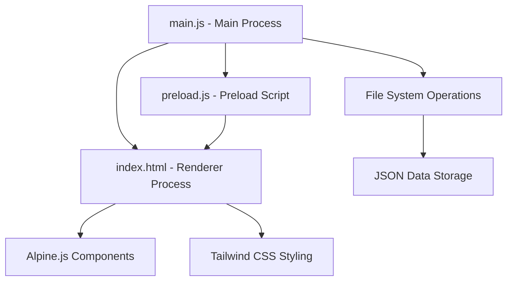

# 📺 TV Show Tracker - Electron App

<!-- Zero Source Specification v1.0 -->
<!-- ZS:COMPLEXITY:MEDIUM -->
<!-- ZS:PLATFORM:DESKTOP -->
<!-- ZS:LANGUAGE:JAVASCRIPT -->

> This is a [TINS](https://github.com/ScuffedEpoch/TINS) (There Is No Source) compatible README. TINS allows LLMs to generate source code from README specifications alone. This project can be implemented using the [TINS-MCP](https://github.com/ScuffedEpoch/TINS-MCP) tool.

## Description

TV Show Tracker is a cross-platform desktop application built with Electron that allows users to track their watching progress for multiple TV shows. The application provides an intuitive interface for users to record which episode and season they are currently watching for each show, add notes with clickable links to streaming services, and manage their entire watch list in one place. All data is stored locally for privacy and includes backup/restore functionality for data safety.

This application serves as an Electron port of the original [Gradio-based TV Show Tracker](https://github.com/MushroomFleet/TV-Show-Tracker-WebUI), optimized for desktop usage with additional features and an improved user interface.

## Functionality

### Core Features

#### 1. Track Progress
- Users can add TV shows to their watch list by entering:
  - Show name (string, required)
  - Current season (integer, required, minimum value: 1)
  - Current episode (integer, required, minimum value: 1)
  - Notes (string, optional, supports URLs)
- The system automatically saves all entries to a local JSON file
- The system provides visual indicators for progression:
  - Forward progress indicator (⏩) when moving to a later episode or season
  - Backward progress indicator (⏪) when moving to an earlier episode or season
- Data persistence across application restarts is handled automatically

#### 2. Watch List Management
- The system displays all tracked shows in a sortable, filterable list view
- Each show entry displays:
  - Show name
  - Current season and episode in format "S{season}E{episode}" (e.g., "S1E5")
  - Visual category indicator:
    - 🆕 for new shows (Season 1, Episodes 1-3)
    - 🌟 for long-running shows (Season 3+)
    - 🎬 for all other shows
  - Preview of notes with clickable URLs
  - Quick edit controls for episode/season modification
  - Delete option
- The list automatically updates when changes are made
- Manual refresh option is available
- Shows are sorted alphabetically by default

#### 3. Backup Management
- Users can create timestamped backups of their watch list data
- Backups are stored in the user's application data directory
- Users can import data from previous backups
- The system automatically validates backup files before import
- The system creates a safety backup before importing data
- Failed imports provide error messages with specific reasons for failure

### User Interface

#### Main Application Window
- The application uses a tabbed interface with three primary tabs:
  1. "Track Progress" tab
  2. "Currently Watching" tab
  3. "Backup Management" tab
- Consistent header with application title and icon across all tabs
- Responsive layout that adjusts to window resizing
- Minimum window dimensions: 800px width, 600px height

#### Track Progress Tab
- Form layout with the following elements:
  - Text input field for show name
  - Number input field for season with increment/decrement buttons
  - Number input field for episode with increment/decrement buttons
  - Textarea for notes with placeholder suggesting URL usage
  - "Track Progress" submit button
- Form validation with error messages for missing required fields
- Success message appears when progress is tracked successfully
- Form maintains last entered values for convenience

#### Currently Watching Tab
- Card-based display for each show with consistent spacing and styling
- Each card contains:
  - Show name as card header
  - Season and episode information
  - Category indicator emoji
  - Notes preview (truncated if too long) with clickable URLs
  - Quick edit controls:
    - "Previous Episode" button (-)
    - "Next Episode" button (+)
    - "Next Season" button
  - Delete button (trash icon)
- Refresh button at the top of the list
- Show removal form at the bottom with text input and "Remove Show" button

#### Backup Management Tab
- Two main sections:
  1. Create Backup section:
     - Description text explaining the backup process
     - "Create Backup" button
     - Success message area for feedback
  2. Import Backup section:
     - Description text explaining the import process and safety features
     - "Select Backup File" button
     - File selection dialog integration
     - Success/error message area for feedback

### Behavior Specifications

#### Progress Tracking Behavior
- When a user submits the tracking form:
  1. The system validates input fields
  2. If validation passes:
     - The system checks if the show already exists in the database
     - If it exists, the system updates the existing record
     - If it's new, the system creates a new record
     - The system saves changes to the data file
     - The system displays a success message
  3. If validation fails:
     - The system highlights invalid fields
     - The system shows appropriate error messages
     - The form data is preserved for correction

#### Quick Edit Controls Behavior
- When a user clicks "Previous Episode" (-):
  1. The system decrements the episode number by 1
  2. If the episode becomes less than 1 and the season is greater than 1:
     - The system decrements the season by 1
     - The system sets the episode to 1
  3. The system displays the backward indicator (⏪)
  4. The system saves the updated data

- When a user clicks "Next Episode" (+):
  1. The system increments the episode number by 1
  2. The system displays the forward indicator (⏩)
  3. The system saves the updated data

- When a user clicks "Next Season":
  1. The system increments the season number by 1
  2. The system resets the episode number to 1
  3. The system displays the forward indicator (⏩)
  4. The system saves the updated data

#### URL Handling Behavior
- When notes contain URLs (text matching regex `https?://[^\s]+`):
  1. The system renders these as clickable links in the watch list
  2. When a user clicks a link:
     - The system opens the URL in the user's default browser
     - The application remains open and focused

#### Backup and Restore Behavior
- When a user creates a backup:
  1. The system generates a timestamped filename (format: `tv_show_backup_YYYY-MM-DD_HH-MM-SS.json`)
  2. The system writes the current data to this file in the application data directory
  3. The system displays a success message with the backup location

- When a user imports a backup:
  1. The system prompts for file selection using the native dialog
  2. The system validates the selected file:
     - Checks if it's a valid JSON file
     - Checks if it contains the expected data structure
  3. If validation passes:
     - The system creates a backup of the current data
     - The system imports the data from the selected file
     - The system displays a success message
  4. If validation fails:
     - The system displays an error message with the specific reason
     - The current data remains unchanged

## Technical Implementation

### Architecture

The application follows a standard Electron architecture with the following components:



#### Main Process (main.js)
- Creates and manages application windows
- Handles application lifecycle events (startup, shutdown, etc.)
- Provides IPC (Inter-Process Communication) endpoints for file operations
- Manages file system interactions for data persistence
- Handles window state management (size, position)

#### Preload Script (preload.js)
- Creates a secure bridge between the renderer process and main process
- Exposes a controlled API to the renderer process using contextBridge
- Handles IPC communications for file operations
- Prevents direct access to Node.js APIs from the renderer process

#### Renderer Process (index.html)
- Implements the user interface using HTML, CSS, and JavaScript
- Uses Alpine.js for reactive UI components
- Uses Tailwind CSS for styling
- Communicates with the main process via the API exposed by the preload script

### Data Structures

#### TV Show Data Model
```javascript
{
  // Main data object structure
  shows: [
    {
      name: string,          // Show name (required)
      season: number,        // Current season (required, integer, ≥ 1)
      episode: number,       // Current episode (required, integer, ≥ 1)
      notes: string,         // Optional notes, may contain URLs
      lastUpdated: string,   // ISO timestamp of last update
      progress: string       // "forward", "backward", or null (visual indicator)
    }
  ],
  // Optional metadata
  meta: {
    lastBackup: string,      // ISO timestamp of last backup
    appVersion: string       // Application version
  }
}
```

#### Backup File Structure
```javascript
{
  // Same structure as the main data object
  shows: [...],
  meta: {
    lastBackup: string,
    appVersion: string,
    backupCreated: string    // ISO timestamp when backup was created
  }
}
```

### Algorithms

#### Show Category Determination
```javascript
function determineCategory(show) {
  if (show.season === 1 && show.episode <= 3) {
    return "new";      // 🆕 indicator
  } else if (show.season >= 3) {
    return "longRunning"; // 🌟 indicator
  } else {
    return "regular";  // 🎬 indicator
  }
}
```

#### URL Detection and Rendering
```javascript
function detectAndRenderUrls(text) {
  const urlRegex = /(https?:\/\/[^\s]+)/g;
  return text.replace(urlRegex, '<a href="$1" class="text-blue-500 hover:underline" target="_blank">$1</a>');
}
```

#### Data Persistence
```javascript
async function saveData(data) {
  // Ensure data directory exists
  await fs.promises.mkdir(path.dirname(DATA_FILE_PATH), { recursive: true });
  
  // Update metadata
  data.meta = data.meta || {};
  data.meta.lastUpdated = new Date().toISOString();
  
  // Write to file
  await fs.promises.writeFile(DATA_FILE_PATH, JSON.stringify(data, null, 2), 'utf8');
  
  return true;
}
```

#### Backup Creation
```javascript
async function createBackup() {
  const timestamp = new Date().toISOString().replace(/:/g, '-').replace(/\..+/, '').replace('T', '_');
  const backupFilename = `tv_show_backup_${timestamp}.json`;
  const backupPath = path.join(getBackupDirectory(), backupFilename);
  
  // Read current data
  const data = await readData();
  
  // Add backup metadata
  data.meta = data.meta || {};
  data.meta.backupCreated = new Date().toISOString();
  
  // Write backup file
  await fs.promises.mkdir(path.dirname(backupPath), { recursive: true });
  await fs.promises.writeFile(backupPath, JSON.stringify(data, null, 2), 'utf8');
  
  return backupPath;
}
```

## Style Guide

### Visual Design
- Color scheme:
  - Primary: #3b82f6 (blue-500)
  - Secondary: #6b7280 (gray-500)
  - Accent: #f59e0b (amber-500)
  - Background: #f9fafb (gray-50)
  - Text: #1f2937 (gray-800)
- Typography:
  - Primary font: System UI font stack
  - Headings: Semi-bold, slightly larger than body text
  - Body text: Regular weight, 16px
- Components:
  - Buttons: Rounded corners (0.25rem), consistent padding (0.5rem 1rem)
  - Cards: White background, light shadow, rounded corners (0.375rem)
  - Inputs: Clear borders, focus state with blue highlight
- Spacing:
  - Consistent 1rem spacing between major components
  - 0.5rem spacing between related elements
  - 2rem padding around page content

### Interactions
- All buttons have hover and active states:
  - Hover: Slightly darker color
  - Active: Even darker color with slight scale reduction
- Form inputs show focus states with blue outline
- Cards have subtle hover effect (slight elevation increase)
- Interactive elements have appropriate cursor indicators
- Feedback messages appear with fade-in animation
- Removal actions require confirmation

## Performance Requirements
- Initial launch time: Under 2 seconds on target hardware
- UI operations response time: Under 100ms
- File operations (save/load): Under 500ms for typical data sizes
- Memory usage: Under 200MB at idle
- CPU usage: Under 5% at idle, under 20% during intensive operations

## Accessibility Requirements
- All interactive elements must be keyboard navigable
- Focus states must be clearly visible
- Color contrast ratios must meet WCAG AA standards
- Text should be resizable without breaking layout
- Critical functionality must have text alternatives to icons
- Error messages must be descriptive and helpful

## Installation

### For Users
- The application should provide an installer for Windows 10 and higher
- The installer should:
  - Install the application to the user's Program Files directory
  - Create start menu shortcuts
  - Create optional desktop shortcuts
  - Register file associations for backup files (.json)
  - Require minimal user interaction

### For Developers
- The project should support standard npm commands for development:
  - `npm install` - Install dependencies
  - `npm run dev` - Run in development mode with DevTools
  - `npm start` - Run in production mode
  - `npm run build` - Build distributable package
- Helper batch files should be included:
  - `install.bat` - Run npm install
  - `start-dev.bat` - Run in development mode
  - `start.bat` - Run in production mode

## Data Storage
- User data is stored in the user's application data directory:
  - Windows: `%APPDATA%\tv-show-tracker-electron\tv_show_progress.json`
  - macOS: `~/Library/Application Support/tv-show-tracker-electron/tv_show_progress.json`
  - Linux: `~/.config/tv-show-tracker-electron/tv_show_progress.json`
- Backups are stored in the same directory with timestamped filenames
- File format is human-readable JSON
- Data is stored locally only, with no cloud synchronization

## Extended Features

### Potential Future Enhancements
- TV show information lookup via external APIs
- Automatic episode count detection
- Viewing statistics and watching habits visualization
- Custom categorization and tagging
- Watch time tracking
- Multiple user profiles
- Import/export to other tracking services
- Dark mode toggle
- Cloud synchronization (optional)

## Testing Scenarios

### Core Functionality Tests
1. **Adding a New Show**
   - Enter "Test Show" in the name field, 1 in the season field, 1 in the episode field
   - Click "Track Progress"
   - Expected: Show appears in the "Currently Watching" tab with 🆕 indicator

2. **Updating Existing Show**
   - Enter "Test Show" in the name field, 1 in the season field, 2 in the episode field
   - Click "Track Progress"
   - Expected: Show updates in the "Currently Watching" tab with ⏩ indicator

3. **Using Quick Edit Controls**
   - Find "Test Show" in the "Currently Watching" tab
   - Click "+" button
   - Expected: Episode increments to 3 with ⏩ indicator
   - Click "-" button
   - Expected: Episode decrements to 2 with ⏪ indicator
   - Click "Next Season" button
   - Expected: Season increments to 2, episode resets to 1 with ⏩ indicator

4. **URL in Notes**
   - Enter "Test Show" in the name field, 2 in the season field, 1 in the episode field
   - Enter "Watch at https://example.com" in the notes field
   - Click "Track Progress"
   - Expected: Notes appear in the "Currently Watching" tab with "https://example.com" as a clickable link

5. **Backup and Restore**
   - Click "Create Backup" in the "Backup Management" tab
   - Expected: Success message with backup path
   - Remove a show from the list
   - Import the backup
   - Expected: Removed show reappears in the list

### Edge Case Tests
1. **Empty Show Name**
   - Leave name field empty, enter 1 in season and episode fields
   - Click "Track Progress"
   - Expected: Validation error highlighting the name field

2. **Invalid Season/Episode Numbers**
   - Enter "Test Show" in the name field, 0 in the season field, 0 in the episode field
   - Click "Track Progress"
   - Expected: Validation errors highlighting both number fields

3. **Importing Invalid Backup**
   - Create a text file with invalid JSON
   - Attempt to import it
   - Expected: Error message indicating invalid format

4. **Handling Very Long Show Names**
   - Enter a show name with 100+ characters
   - Expected: UI properly handles the long text with truncation or wrapping

5. **Rapid Multiple Updates**
   - Quickly click the "+" button multiple times
   - Expected: All updates are properly registered without data corruption

## Additional Information

### Project Structure
```
tv-show-tracker-electron/
├── main.js                 # Electron main process
├── preload.js              # Preload script for secure IPC
├── index.html              # Main application UI
├── package.json            # Project configuration
├── package-lock.json       # Dependency lock file
├── install.bat             # Batch file to install dependencies
├── start.bat               # Batch file to run the app
├── start-dev.bat           # Batch file to run with DevTools
└── assets/                 # Application assets
    ├── create-icon.html    # Tool to create app icon
    └── icon.png            # Application icon
```

### Dependencies
- Electron: ^22.0.0
- Alpine.js: ^3.10.0
- Tailwind CSS: ^3.2.0
- Font Awesome: ^6.2.0
- Chart.js (potential future addition): ^4.0.0

### Development Dependencies
- electron-builder: ^23.6.0
- tailwindcss: ^3.2.0
- concurrently: ^7.6.0
- wait-on: ^7.0.1
- cross-env: ^7.0.3
